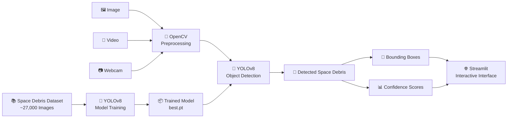

# 🛰️ Space Debris Detection Using YOLOv8

A deep learning-based **Space Debris Detection Simulator** that detects and visualizes space debris from images, videos, and webcam input using **YOLOv8, OpenCV, and Streamlit**.

The project provides an interactive interface for exploring object detection results and demonstrates the use of computer vision for **Space Situational Awareness (SSA)** applications.

---

## 🚀 Live Demo

🔗 **[Launch Space Debris Detection App](https://space-debris-detection.streamlit.app)**

---

## 🧠 Project Overview

Space debris refers to inactive or discarded human-made objects orbiting Earth, including fragments from satellites, rockets, and other spacecraft.

This project uses **YOLOv8 object detection** to identify space debris in visual data and display the detected objects with bounding boxes and confidence scores.

The trained model is integrated into a **Streamlit web application**, allowing users to interact with the detection system without running the model manually from the command line.

---

## 🏗️ System Architecture



### Detection Pipeline

```text
Input
  │
  ├── Image
  ├── Video
  └── Webcam
       │
       ▼
OpenCV Processing
       │
       ▼
YOLOv8 Detection Model
       │
       ▼
Space Debris Detection
       │
       ├── Bounding Boxes
       └── Confidence Scores
       │
       ▼
Streamlit Visualization
```

---

## 🛠️ Tech Stack

| Category             | Technologies           |
| -------------------- | ---------------------- |
| Programming Language | Python                 |
| Deep Learning        | YOLOv8                 |
| Object Detection     | Ultralytics            |
| Computer Vision      | OpenCV                 |
| Web Application      | Streamlit              |
| Model                | YOLOv8 trained model   |
| Development          | VS Code / Google Colab |
| Version Control      | Git & GitHub           |

---

## ✨ Features

### 🔍 Object Detection

* Detects space debris using a trained YOLOv8 model.
* Generates bounding boxes around detected objects.
* Displays confidence scores for detections.

### 🖼️ Image Detection

Upload an image and run the trained model to identify space debris.

### 🎥 Video Detection

Process video input and visualize detected objects frame by frame.

### 📷 Webcam Detection

Use a webcam to perform real-time detection.

### 🎚️ Adjustable Confidence Threshold

Users can control the confidence threshold to adjust detection sensitivity.

### 🌐 Interactive Streamlit Interface

The model is integrated into a simple web interface so users can interact with the detection system easily.

---

## 📚 Dataset

The project was developed using a **space debris image dataset containing approximately 27,000 images**.

The dataset was used for training and developing the YOLOv8 object detection model.

### Dataset Pipeline

```text
Space Debris Images
        │
        ▼
Dataset Preparation
        │
        ▼
YOLOv8 Training
        │
        ▼
Trained Detection Model
        │
        ▼
best.pt
        │
        ▼
Streamlit Application
```

> The dataset is not included directly in this repository due to its size. The trained model and application are used for inference.

---

## 🤖 YOLOv8 Model

The project uses **YOLOv8** from the Ultralytics framework for object detection.

YOLO (You Only Look Once) performs object detection by processing an image in a single inference pipeline, making it suitable for applications requiring efficient visual detection.

### Model Workflow

```text
Input Image / Frame
        ↓
YOLOv8 Model
        ↓
Object Detection
        ↓
Bounding Box Prediction
        ↓
Confidence Score
        ↓
Visualization
```

The trained model is loaded by the application and used directly for inference.

---

## 🖥️ Application Interface

The Streamlit application provides an interactive environment for testing the trained detection model.

### Available Modes

```text
┌───────────────────────────────┐
│     Space Debris Detector     │
├───────────────────────────────┤
│                               │
│  📁 Image Upload              │
│  📷 Webcam Detection          │
│                               │
│  🎚️ Confidence Threshold      │
│                               │
│  🔍 Detection Results         │
│                               │
└───────────────────────────────┘
```

---

## 📂 Project Structure

```text
space-debris-detection/
│
├── app.py                  # Streamlit application
├── detector.py             # Detection logic
├── train_model.py          # Model training script
├── test.py                 # Testing script
├── data.yaml               # Dataset configuration
├── requirements.txt        # Python dependencies
│
├── best.pt                 # Trained YOLOv8 model
├── yolov8n.pt              # YOLOv8 base model
│
├── models/                 # Model-related files
├── runs/                   # Training / inference outputs
│
└── README.md               # Project documentation
```

> Dataset files are kept outside the repository because of their size.

---

# ⚡ Quick Start

## 1️⃣ Clone the Repository

```bash
git clone https://github.com/VK241105/space-debris-detection.git
```

Navigate into the project:

```bash
cd space-debris-detection
```

---

## 2️⃣ Create a Virtual Environment

### Windows

```bash
python -m venv venv
```

Activate it:

```powershell
venv\Scripts\activate
```

---

## 3️⃣ Install Dependencies

```bash
pip install -r requirements.txt
```

---

## 4️⃣ Run the Streamlit Application

```bash
streamlit run app.py
```

The application will open in your browser.

Usually, Streamlit runs locally at:

```text
http://localhost:8501
```

---

# 🌐 Deployment

The application is deployed using **Streamlit Community Cloud**.

### Deployment Flow

```text
GitHub Repository
       │
       ▼
Streamlit Community Cloud
       │
       ▼
requirements.txt
       │
       ▼
app.py
       │
       ▼
YOLOv8 Model
       │
       ▼
Live Web Application
```

### Live Application

🔗 **https://space-debris-detection.streamlit.app**

---

# 🔄 How It Works

## Step 1 — Input

The user provides visual data through:

* Image upload
* Video input
* Webcam

---

## Step 2 — Preprocessing

OpenCV is used to handle image and video processing before passing the input to the detection model.

---

## Step 3 — YOLOv8 Detection

The trained YOLOv8 model processes the input and identifies objects belonging to the trained detection class.

---

## Step 4 — Detection Results

For every detected object, the application generates:

* Bounding box
* Confidence score
* Detection visualization

---

## Step 5 — Visualization

The results are displayed directly through the Streamlit interface.

---

# 🧩 Key Components

### `app.py`

Responsible for the Streamlit user interface and connecting user inputs with the detection pipeline.

### `detector.py`

Contains the object detection logic used to load the YOLOv8 model and perform inference.

### `best.pt`

The trained YOLOv8 detection model used by the application.

### `data.yaml`

Contains the dataset configuration used during YOLOv8 training.

### `requirements.txt`

Contains the Python dependencies required to run the application.

---

# 🎯 Use Cases

The project demonstrates how computer vision can be applied to:

* Space Situational Awareness
* Visual identification of space objects
* Space debris research prototypes
* Computer vision experimentation
* Deep learning-based object detection
* Educational demonstrations of YOLOv8

---

# 🔮 Future Scope

Potential improvements include:

* 🌍 Integration with satellite imagery
* 📡 Processing larger real-time video streams
* 🛰️ Integration with space object tracking systems
* 📈 Detection analytics and visualization dashboards
* 🔄 Improved model training with additional datasets
* ⚡ Optimization for faster inference
* ☁️ Integration with cloud-based processing

---

# 📌 Project Highlights

```text
✔ YOLOv8-based object detection
✔ Computer vision pipeline
✔ Image detection
✔ Video detection
✔ Webcam detection
✔ Adjustable confidence threshold
✔ Interactive Streamlit application
✔ Approximately 27,000-image dataset
✔ Deployed web application
```

---

# 📖 Research Context

This project explores the application of **deep learning-based object detection techniques for Space Situational Awareness**.

The system demonstrates how a trained object detection model can be integrated with computer vision and an interactive web interface to visualize detected space debris.

---

# 👩‍💻 Author

**Vaishnavi Mane**

B.Tech — Computer Science & Engineering
Artificial Intelligence & Machine Learning

🔗 **GitHub:** [VK241105](https://github.com/VK241105)

---

# ⭐ Support

If you find this project useful or interesting, consider giving the repository a ⭐ on GitHub.

---

## 🛰️ Space Debris Detection

**Deep Learning • YOLOv8 • Computer Vision • Streamlit**

> Building computer vision solutions for Space Situational Awareness.
